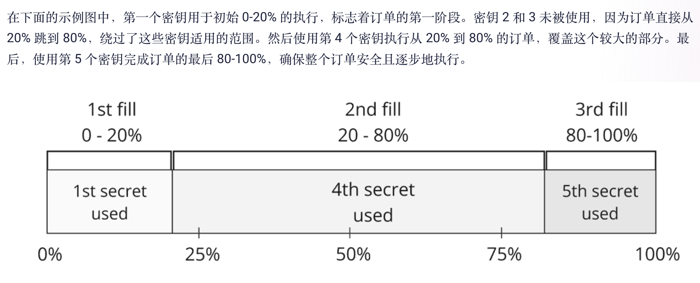

## swap api
- fusion+
  - cross-chain
  - 白手套，maker签署之后，不需要再操作
  - 优惠的价格，荷兰拍卖，partial fill
  - 可靠，resolver
  - 安全， hashlock, timelock, kyc resolver
- fusion
  - intent-based, on-chain + off-chain
  - MEV保护，不会受抢跑，三明治攻击影响
  - gas cost abstraction,need not native assets,resolvers cover gas
  - 增加灵活性，设置交易条件，交易后互动
- classic swaps
  - 包含上百个流动性来源
  - 优惠的价格，友好的汇率
  - 交易拆分至多个流动性池子，降低价格影响，滑点
  - 智能路由
  - 定制（part fill, 滑点limit， unoswap直接交换）

### fusion+
- 无需中心化托管人
- maker  taker
- phase
  - anouncement
  - deposit
  - claim
  - rollback
- partial fill
  - merkle tree，每个参与者负责自己的部分，尽量不暴露超出范围的部分
  - merkle tree的元素 不一定和每次fill的部分一致，甚至完全没映射关系，N+1 secret 负责 complete order
  - 

#### swagger
- orders
  - getCrossChainSwapActiveOrders
  - getActualEscrowFactoryContractAddress
  - getOrdersByMaker
  - getDataForWithdrawalAndCancellation
  - get idx of each secret for specific order
  - get idx of secret for all orders
  - getDataForWithdrawalAndCancellation on public periods
  - getOrdersByOrderHash
  - getOrdersByOrderHashes
- quoter
  - build order by quote
  - get quote details
  - get quote with custom preset details
- relayer
  - submit order
  - submit cross chain orders
  - submit secret

#### becoming a resolver
- unicorn power
- farm
- test case
#### sdk

### fusion

### classic swap