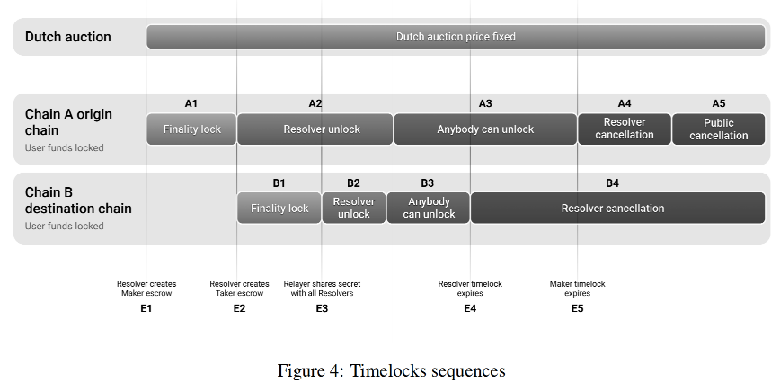

## 1inch

**whitepaper**

### 1 atomic swaps & escrow contract
- escrow contract ensures the atomic
    - powered by Hashed Timelock Contracts
- key components
    - hashlock
    - timelock
- steps
    - agreement and secret generation
        - secret , hash
    - initiation of swap
        - create escrow
        - hash to lock  +  timelock
    - verifiation + counter-escrow
        - bob find a escrow
        - create b escrow
            - same hash to lock, shorter timelock
    - completion
        - a claim b asset by secret
        - b claim a asset by secret
- conclusion
    - hashlock,timelock ensures security
    - hashlock : secret + hash

### 2 1inch fusion+
#### intro
- sign order, taker handle everything
- fusion order, dutch auction
- resolver solve the unresponsiveness
#### hashlock with 1inch fusion order
- escrow is deployed on each chain
- phase 1 - announcement
    - makes sign order
    - relayer shares the order with resolver
    - dutch auction
- phase 2 - deposit phase
    - source chain lock
    - destination chain deposit
- phase 3 - withdrawal phase
    - relayer ensure both escrows contain the required token
    - maker disclose the secret
    - taker shares the secret
    - unlock asset
- phase 4 - recovery
    - when the timelock expired, resolver can rollback
    - safety deposit
        - when a resolver deposit assets to the escrow,they include ann additional amount of native asset
        - the safety deposit will incentiveizes resolvers to perform cancellation or withddrawal
#### secrets handling
- storage
    - secret will be stored on maker side until escrows are created
    - relayer create the signal
- conditional transmission
    -  when the resolver fulfilled their part,relayer will send the secret
- trust and convenience
    - maker just need start until end
- security consideration
    - locks are defined separately for each chain
    - mltigate potential chain reorganization

#### dutch auction
- 
- action settings are included in the order
  - auction start timestamp
    - 这个时间是 签名时间 + waiting period
    - resolver可以在正式开始之前就成交，以设定的最大价格
  - waiting period
    - this delay enables auctions starts after signing the order
    - especially for multisig wallets
  - auction start rate
    - the maximum exchange rate
  - minimum return amount
  - decreate rate
    - order's exchange rate declines over time
    - piecewise linear  分段线性
- price curve
  - each segment have its own decrease speed
  - 6 segments   X/6, 2X/6,,,,
  - two-thirds of the auction, descende from spotPrice towards prevailing market price
  - partial fills offers more favarable prices, quicker order fulfillment
- Partial fills
  - different resovlers fill different parts of the order
  - intent-based approach need pay gas if the order fail
  - 根据实际结果，此种成交方式 能够得到更多的回报
- price adjustments on gas costs
  - 用户预先垫付的gas，可能后期因为市场gas波动，而无法覆盖执行成本
  - 传统方式，订单可能会卡主，过期
  - fusion+ the price curve will be adjusted to corrent the execution costs
    - 假定user a预先多付一些gas，设计gas由user b支付
    - price是一个综合成本,而不是简单的市场价格
    - 调整价格就可以符合resolver的预期
  - 

#### timelocks
- intro
  - 为了避免asset loss
- finality timelocks
  - once escrow created on chain a 
    - during finality timelock
    - no withdraw; 
  - create escrow on chain b
    - lock is applied on chain b as well
- hashlock
  - relayer share the secret with all resovlers
  - withdraw on chain a & b ; or rollback
  - anybody can unlock
- cancellation timelocks
  - chain a:  resolver cancel , public cancel
  - chain b:  resovler cancel
- swap completion incentives

#### partial fills and secret management
- order is filled completely
  - a single secret can unlock two parties
- partially filled
  - one secret is not safe
  - split the original order into N equal parts
    - N + 1 secrets
    - 自己的理解：
      - 20%的secret 可以claim 20%
      - 80%的secret 可以claim 20 ~ 80%的  60%
      - N+1 最后一个secret是为了complete order
        - 提高了程序的兼容性，各种场景，都尽量fulfill

### 3 protocol settings governed by DAO
- some key parameters controlled by DAO
  - Maximum swap amount
    - 协议初期防范风险，后期逐步放开
  - Fee structure
    - Resolver fees
    - DAO adjustment authority

### 4 Conclusion
- 1inch fusion+ 一种基于意图的cross-chain swap
- 荷兰式拍卖，提升竞争力
- 方便 安全